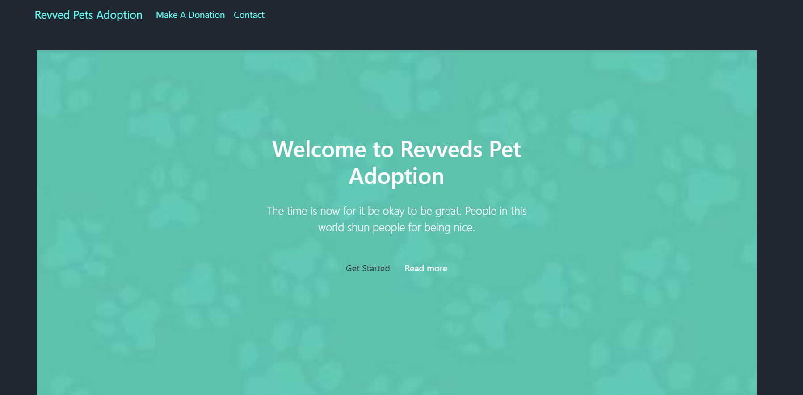
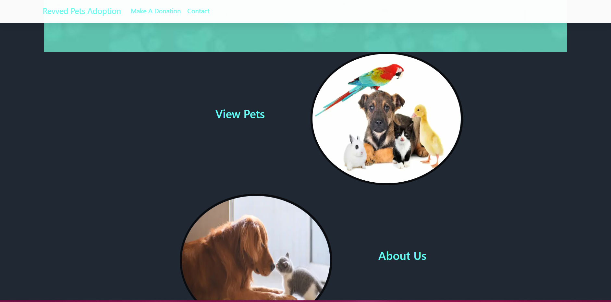

# Pet Adoption

  

  ## Description
  This app provides a mock up page for a pet-adoption client. 

  ## Table of Contents
  * [Installation](#installation)
  * [Usage](#usage)
  * [Screenshots](#screenshots)


  ## Installation
  To install, download as zip. You should have node.js. 
  Then, run the development server:

   ```bash
   npm run dev
     ```

  ## Usage
  The purpose of this app is to provide customer's for the pet adoption an effiecient way to view potential pets.

  ## Screenshots
  
  The home page provides a straightforward yet modern design to appeal to clients and customers.

  
  Once you scroll down you are introduce to click on to view pets or learn more about the pet adoption agency.


  ## Contributing
  For further contributions, please contact me via email.


  ## Questions
  If you have any questions or concerns about this application, please contact me via email: __bradleyj1@email.arizona.edu__ You may also visit my Github page: __https://github.com/JazmyneB__


This is a [Next.js](https://nextjs.org/) project bootstrapped with [`create-next-app`](https://github.com/vercel/next.js/tree/canary/packages/create-next-app).


